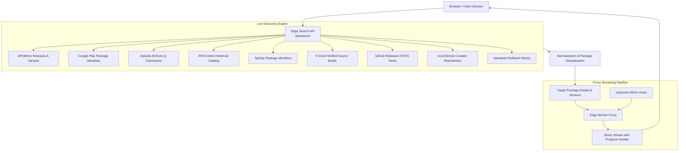

> [!NOTE]
> **APKScope is live:** Access the hosted security research platform directly at **[apkscope.vercel.app](https://apkscope.vercel.app)**. No installation, account, or API key required.

<div align="center">

# APKScope

### Direct Android Build & Package Discovery for Security Research

APKScope is a specialized discovery engine for security researchers, penetration testers, and bug bounty hunters. It queries public package repositories and mirrors to extract authentic Android application packages, version histories, cryptographic checksums, signer certificates, and attack surface indicators in real time.

<br/>

[](https://apkscope.vercel.app)
[](https://www.linkedin.com/in/jojin-john/)
[](./LICENSE)
[](https://vercel.com/edge)
[](https://apkscope.vercel.app)

<br/>

<a href="https://apkscope.vercel.app"><strong>Launch Web Application</strong></a> &nbsp;&bull;&nbsp; <a href="https://www.linkedin.com/in/jojin-john/"><strong>Developer LinkedIn</strong></a> &nbsp;&bull;&nbsp; <a href="#license--proprietary-terms"><strong>License Terms</strong></a>

<br/>

</div>

---

> [!TIP]
> **Zero Local Setup:** APKScope operates as a public cloud utility. Users do not need to clone source code, maintain local node environments, or configure upstream proxy workers. All discovery and analysis features are available directly at [apkscope.vercel.app](https://apkscope.vercel.app).

---

## Table of Contents

- [What is APKScope?](#what-is-apkscope)
  - [Why APKScope Exists](#why-apkscope-exists)
  - [Zero-Hosting Architecture](#zero-hosting-architecture)
- [Architecture & Data Flow](#architecture--data-flow)
- [Key Capabilities](#key-capabilities)
- [Supported Repositories & Catalogs](#supported-repositories--catalogs)
- [Bug Bounty & Reconnaissance Workflow](#bug-bounty--reconnaissance-workflow)
- [Common Questions](#common-questions)
- [Developer & Credits](#developer--credits)
- [License & Proprietary Terms](#license--proprietary-terms)

---

## What is APKScope?

APKScope is a targeted reconnaissance utility engineered for Android application auditing and vulnerability research. It resolves package names, indexes version histories, validates binary checksums, and streams application packages directly from authoritative sources.

Most consumer mirror sites impose account registrations, CAPTCHA hurdles, rate throttles, or intrusive scripts. APKScope eliminates these obstacles by providing a streamlined, automated discovery workflow built strictly for technical researchers.

### Why APKScope Exists

Modern Android bug bounty engagements and reverse engineering workflows require rapid access to clean target binaries:
- Identifying historical releases to test for regressions, unpatched endpoints, or hardcoded credentials.
- Extracting package identifiers and manifest permissions without configuring emulator store environments.
- Comparing cryptographic checksums (MD5, SHA256) against VirusTotal intelligence before staging binaries in sandbox environments.

### Zero-Hosting Architecture

> [!IMPORTANT]
> **APKScope does not store, host, mirror, or redistribute binary files.**

All download requests are proxied on-demand through an edge network directly from allowlisted upstream distribution hosts. Binary streams pass through the proxy with exact length and integrity headers preserved. No APK files, user tracking databases, or uploaded artifacts reside on APKScope infrastructure.

---

## Architecture & Data Flow



---

## Key Capabilities

- **Unified Multi-Source Discovery**: Queries nine independent package sources simultaneously to eliminate coverage gaps.
- **Package Identifier Resolution**: Maps colloquial application titles directly to canonical reverse-domain package names (such as `com.vendor.application`).
- **Version Rollback Indexing**: Aggregates chronological release histories, file sizes, and release dates to assist in patch diffing.
- **Cryptographic Integrity & Intelligence**: Provides real-time MD5 and SHA256 digests with direct VirusTotal lookup references.
- **Attack Surface & Permission Inspector**: Categorizes declared manifest permissions, highlighting dangerous runtime privileges such as camera, audio, location, and background storage access.
- **Live Proxy Download Streaming**: Delivers direct binary streams through an edge proxy with standard Content-Disposition and byte-length headers for download accuracy.
- **QR Code Target Handoff**: Generates high-density QR codes to transfer direct download targets directly to isolated hardware or physical test devices.
- **Progressive Web Application (PWA)**: Supports offline caching and homescreen installation on desktop and mobile platforms without external browser chrome.

---

## Supported Repositories & Catalogs

| Source | Coverage Focus | Primary Intelligence Contributed |
|---|---|---|
| **Google Play** | Global Consumer Releases | Official package IDs, developer records, store categories, official icons |
| **APKMirror** | Verified Developer Uploads | Target variant architectures, release branch metadata, signature verification |
| **Aptoide** | Public Mirror Catalog | Extensive historical version archives, MD5 checksums, certificate signers |
| **APKCombo** | International Mirrors | Historical versions, split bundle references, localized listings |
| **TapTap** | Asian & Global Application Catalog | Accurate package mapping and early regional rollouts |
| **F-Droid** | Free & Open Source Software | Transparent source builds, reproducible compilation logs |
| **GitHub Releases** | Open Source Security Tools | Direct untouched release assets for developer and security tooling |
| **IzzyOnDroid** | Curated Independent F-Droid Repo | Independent open-source packages prior to main catalog entry |
| **Uptodown** | Long-Term Archive | Deep rollback archives useful for historical vulnerability research |

---

## Bug Bounty & Reconnaissance Workflow

```
1. Target Reconnaissance
   Input target domain or product title -> Extract confirmed package identifiers.

2. Release Pinning & Patch Diffing
   Audit version catalog -> Identify target versions pre-dating critical security patches.

3. Integrity Pre-Check
   Verify binary hash signatures against known VirusTotal records prior to execution.

4. Surface Auditing
   Inspect high-risk permission demands and exported component flags via the Security Inspector.

5. Testbed Provisioning
   Scan generated QR code with a dedicated lab test device or emulator for direct installation.
```

> [!WARNING]
> **Authorization Requirement:** Only conduct security assessments, static decompilation, and dynamic testing against applications, systems, and networks where you have obtained documented authorization or are participating in a sanctioned vulnerability disclosure program.

---

## Common Questions

<details>
<summary><strong>Where can I access APKScope?</strong></summary>

APKScope is deployed and accessible globally at **[https://apkscope.vercel.app](https://apkscope.vercel.app)**.
</details>

<details>
<summary><strong>Do I need to clone this repository to use the service?</strong></summary>

No. The hosted web application is the primary distribution channel. All search, inspection, resolution, and download features run within the managed deployment.
</details>

<details>
<summary><strong>Does APKScope store any downloaded files?</strong></summary>

No. APKScope infrastructure acts strictly as an edge-based inspection and proxy streaming router. Binary data is transferred on-the-fly directly from origin hosts.
</details>

<details>
<summary><strong>Are user credentials or accounts required?</strong></summary>

No. APKScope requires zero authentication, zero account registration, and sets no tracking cookies. User preferences such as theme selection are maintained strictly within local client storage.
</details>

<details>
<summary><strong>Can this tool be used for offensive testing?</strong></summary>

APKScope is a reconnaissance and asset discovery tool designed for defensive auditors, ethical researchers, and authorized penetration testers. Users bear full responsibility for ensuring their security activities comply with applicable laws and program boundaries.
</details>

---

## Developer & Credits

APKScope is designed, architected, and maintained by **JOJIN JOHN**.

- **LinkedIn**: [https://www.linkedin.com/in/jojin-john/](https://www.linkedin.com/in/jojin-john/)
- **Live Platform**: [https://apkscope.vercel.app](https://apkscope.vercel.app)

---

## License & Proprietary Terms

Copyright &copy; 2026 **JOJIN JOHN**. All Rights Reserved.

- Permission is granted to freely access and utilize the public web service at [apkscope.vercel.app](https://apkscope.vercel.app) for lawful security research and educational purposes.
- **Unauthorized copying, cloning, code scraping, mirroring, re-distribution, or re-hosting of the source code, architecture, or brand assets is strictly prohibited.**
- For commercial licensing, integrations, or inquiries, please contact the developer via [LinkedIn](https://www.linkedin.com/in/jojin-john/).

See the [LICENSE](./LICENSE) file for complete legal terms.
